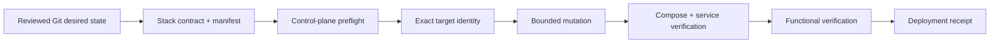
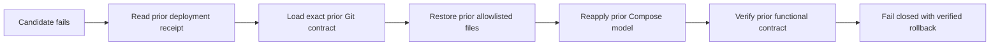

# HomeLab Ops Blueprint

[](https://github.com/d-prost/homelab-ops-blueprint/actions/workflows/validate.yml)
[](https://securityscorecards.dev/viewer/?uri=github.com/d-prost/homelab-ops-blueprint)
[](LICENSE)

**HomeLab Ops Blueprint is a reference implementation of Verified Convergence for small Docker Compose environments.**

Verified Convergence means that a Production change is accepted only when the project can prove, from machine-checkable inputs and runtime checks, that:

- the intended Git state authorized the change;
- the exact target identity was verified;
- only contract-declared files were allowed to change;
- container images were immutable and pinned by digest;
- the resulting runtime passed functional verification;
- the accepted state was recorded as deployment evidence;
- and, if convergence failed, the exact previously accepted Git contract was restored and verified again.

The project deliberately occupies the space between ad-hoc `docker compose up` workflows and full cluster orchestration. It uses Git, Ansible and Docker Compose to make small-environment operations **bounded, inspectable, fail-closed and reversible** without requiring Kubernetes or an always-on GitOps controller.

The repository is intentionally environment-neutral. It is designed to be reusable without publishing real hostnames, IP addresses, credentials, backup metadata, private PKI details, or Production evidence.

## The core idea: Verified Convergence

A deployment is not considered successful merely because containers started. It must move through an explicit proof chain:



On failure, rollback is itself treated as a verified convergence operation:



This is the defining property of the project: **the accepted state is not just deployed; it is attributable to a Git commit, constrained by a contract, checked on the real target, and recoverable to the exact previously accepted contract.**

## Safety properties

A Production deployment is refused unless the repository is clean, the current branch is `main`, local `main` exactly matches `origin/main`, a real Production inventory exists locally, and the target hostname exactly matches the inventory declaration.

Managed container images must use `@sha256:` digests. Only files declared by the stack contract and its matching `MANIFEST.tsv` may be installed. A deployment record is written only after functional checks pass.

Before replacing an already managed stack, the role reads the prior deployment receipt, loads that exact contract from Git history, and captures only its allowlisted files in a transient root-owned transaction directory. If deployment or verification fails, it removes candidate-only files, restores the prior files, reapplies the prior Compose model, verifies it with the prior contract, and removes the transaction directory.

Compose rendering stays on the control plane. Runtime checks and functional verification run on the target, with the verifier and contract transferred by Ansible. A remote target therefore needs Docker and Python, not a repository checkout.

These guarantees protect declared configuration convergence. They are not a substitute for application-data backups or restore testing.

## What this project is not

This is not a Kubernetes distribution, a Portainer replacement, a generic CI/CD platform, or a catalogue of hundreds of self-hosted applications.

It intentionally does **not** optimize for feature count. New capabilities are expected to strengthen one or more Verified Convergence properties: authorization, target identity, bounded mutation, runtime verification, deployment evidence, rollback verification, or recovery readiness.

## Public/private boundary

The repository must never contain real operational secrets or identifying infrastructure data. Keep these outside Git or in a separate private repository:

- Production hostnames, IP addresses, internal DNS zones, and VPN details;
- passwords, API tokens, private keys, recovery codes, and secret `.env` files;
- real backup receipts, Run IDs, Snapshot IDs, and restore credentials;
- firewall exports, incident logs, private audit evidence, and PKI internals;
- break-glass procedures and private recovery material.

The validation suite includes a public-safety check in addition to Gitleaks. See [`docs/PUBLIC_PRIVATE_BOUNDARY.md`](docs/PUBLIC_PRIVATE_BOUNDARY.md).

## Repository layout

```text
.github/                    CI, Scorecard, Dependabot, issue/PR templates
ansible/                    guarded convergence logic and example inventories
docs/                       architecture, adoption, release, and maintainer docs
recovery/                   restore-drill template and stateful adoption checklist
scripts/                    deployment, validation, verification, and safety tooling
stacks/dozzle/              public stateless example stack
tests/                      contract, integrity, operational, and rollback proofs
```

## Quick start

### 1. Requirements

- Linux
- Git
- Docker Engine with Compose v2
- Ansible Core
- Python 3 and PyYAML

For the full maintainer validation suite, also install ShellCheck, yamllint, and Gitleaks.

### 2. Validate the repository

```bash
make validate
```

### 3. Create a private Production inventory

```bash
cp ansible/inventory/production/hosts.example.yml \
   ansible/inventory/production/hosts.yml
```

Edit the ignored `hosts.yml` locally and replace every `CHANGE_ME` value.

### 4. Dry-run the example stack

```bash
bash scripts/deploy-stack.sh dozzle --check
```

### 5. Converge explicitly

```bash
bash scripts/deploy-stack.sh dozzle
```

### 6. Tag a verified operational release

```bash
bash scripts/tag-release.sh
```

To redeploy an earlier verified operational release:

```bash
bash scripts/rollback-stack.sh dozzle release-YYYYMMDD-HHMMSSZ
```

## CI and proof model

The validation workflow currently runs two independent proof classes:

- **Static proof**: Bash/Python/YAML checks, stack-contract validation, Ansible syntax checks, public-safety validation, and Gitleaks;
- **Disposable rollback proof**: real Dozzle deployment on a disposable runner, intentional failure injection, automatic configuration rollback, SHA-256 comparison, and functional HTTP verification after rollback.

A separate OpenSSF Scorecard workflow evaluates repository security practices with narrowly scoped permissions. Dependabot watches pinned GitHub Actions for updates.

The roadmap extends this model toward richer machine-readable deployment evidence, explicit rollback evidence, remote-target proof, stateful-readiness gates, and multi-host convergence reports.

## Project scope

The project is a **Verified Convergence blueprint**, not a complete HomeLab platform. It deliberately does not provide automatic public-CI Production deployment, a secret store, firewall management, database rollback, or backup orchestration.

Stateful services may be adopted only after their external data, secret, export, backup, and functional restore boundaries are documented and proven. See [`recovery/STATEFUL_ADOPTION_CHECKLIST.md`](recovery/STATEFUL_ADOPTION_CHECKLIST.md).

See [`ROADMAP.md`](ROADMAP.md) for the development sequence and explicit non-goals.

## Contributing

Contributions are welcome when they improve the Verified Convergence model: stronger contracts, clearer evidence, safer target selection, better functional verification, deterministic rollback, recovery proof, portability, or focused examples.

Start with [`CONTRIBUTING.md`](CONTRIBUTING.md), [`GOVERNANCE.md`](GOVERNANCE.md), and [`ROADMAP.md`](ROADMAP.md).

## Security

Do not report vulnerabilities containing sensitive infrastructure details in a public issue. Follow [`SECURITY.md`](SECURITY.md).

## Releases

Public project releases use Semantic Versioning. Operational deployment tags created by `scripts/tag-release.sh` are separate from project version tags. See [`docs/RELEASES.md`](docs/RELEASES.md).

## License

MIT. See [`LICENSE`](LICENSE).
