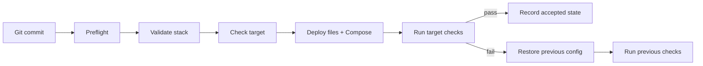

# HomeLab Ops Blueprint

A small Git + Ansible workflow for deploying Docker Compose stacks without adding a full orchestration platform.

[](https://github.com/d-prost/homelab-ops-blueprint/actions/workflows/validate.yml)
[](https://securityscorecards.dev/viewer/?uri=github.com/d-prost/homelab-ops-blueprint)
[](LICENSE)

I built this for homelab-sized environments where `docker compose up -d` is easy, but making changes safely and rolling them back is not. Git holds the stack definition, Ansible applies it, and the target is checked before a deployment is considered successful.

The current implementation is aimed at single-host Docker Compose setups. `stacks/dozzle/` is the reference stack.

## Quick start

On a fresh Debian or Ubuntu host, the setup script installs the required packages, starts Docker, validates the repository and deploys the reference stack locally:

```bash
bash scripts/setup.sh
```

The script installs Docker Engine with Compose v2 when needed, Ansible Core, Python/PyYAML and the local validation tools. It also creates any external Docker networks required by the selected example stack.

To install the dependencies without deploying anything:

```bash
bash scripts/setup.sh --install-only
```

To use another stack after adding it to `stacks/`:

```bash
bash scripts/setup.sh --stack my-stack
```

Automatic package installation currently supports Debian and Ubuntu. On another Linux distribution, install Docker Engine with Compose v2, Ansible Core, Python 3 with PyYAML, Git, `sudo`, `tar` and `flock`, then use the normal deployment commands below.

## Production setup

For a Production host, install the dependencies first without starting the Lab example:

```bash
bash scripts/setup.sh --install-only
```

Create the local Production inventory:

```bash
cp ansible/inventory/production/hosts.example.yml \
   ansible/inventory/production/hosts.yml
```

Edit `hosts.yml` and replace the example values with the real target settings.

Preview the deployment:

```bash
bash scripts/deploy-stack.sh dozzle --check
```

Deploy it:

```bash
bash scripts/deploy-stack.sh dozzle
```

The Production entry point expects a clean `main` that matches `origin/main`.

## What happens during a deployment

Before Production is changed, the deployment path verifies that:

- the local checkout is a clean, up-to-date `main`;
- the selected inventory host matches the target hostname;
- the exact selected stack payload passes the current contract validator;
- each stack declares the files it manages and the services it expects;
- `MANIFEST.tsv` matches the source-to-target file mapping;
- container images are pinned by digest;
- functional checks pass on the target after Compose starts;
- the accepted Git commit is recorded only after those checks pass.

Files that were managed by the previous release but are no longer part of the new contract are removed. Compose is also run with orphan cleanup so removed services do not remain running after a successful deployment or rollback.

If a deployment fails and the previous managed configuration can be reconstructed, the role restores that configuration and runs the previous checks again. This rollback covers managed configuration, not application data or Docker volumes.

Stateful stacks can also require recovery-readiness evidence before a Production change. That is handled separately from configuration rollback; see [`docs/RECOVERY_READINESS.md`](docs/RECOVERY_READINESS.md).

## Stack layout

Each stack is self-contained:

```text
stacks/dozzle/
├── compose.yaml
├── defaults.env
├── stack.yml
└── MANIFEST.tsv
```

`stack.yml` describes the target directory, managed files, expected services and functional checks. `MANIFEST.tsv` maps repository files to their target paths. The deployment role stages and installs only the files declared by that contract.

A minimal deployment flow looks like this:



## Releases and rollback

Create an operational release tag with:

```bash
bash scripts/tag-release.sh
```

To deploy an earlier tagged stack payload:

```bash
bash scripts/rollback-stack.sh dozzle release-YYYYMMDD-HHMMSSZ
```

Historical releases provide the stack payload only. The current checkout still supplies inventory, validation and deployment logic. Production release tags are checked against `origin`, and the selected release commit must belong to `origin/main` history.

Automatic rollback is intentionally limited to configuration that was managed by this project and can be reconstructed from the previous accepted state. Database contents, uploads, media, indexes and other persistent application data need their own backup and restore process.

## Stateful stacks

A stack can declare stateful services in `stack.yml`. For Production, the deployment path can require a recovery-readiness file and a backup-age policy:

```bash
export HOMELAB_RECOVERY_EVIDENCE=/path/to/recovery-readiness.json
export HOMELAB_BACKUP_MAX_AGE_SECONDS=<seconds>
```

The readiness check verifies that the evidence applies to the current stack generation before the deployment proceeds. The schema and hash calculation are documented in [`docs/RECOVERY_READINESS.md`](docs/RECOVERY_READINESS.md).

## Validation

The main local commands are:

```bash
make validate     # syntax, contracts, tests and repository checks
make lab-proof    # disposable deployment, injected failure and rollback test
make ci           # CI-oriented validation including Gitleaks when available
```

GitHub Actions runs static validation and a disposable rollback test. The rollback workflow deploys the Dozzle example, introduces a failure, restores the previous configuration and verifies the service again.

## Repository layout

| Path | Contents |
|---|---|
| `ansible/` | inventories, playbooks and the managed-stack role |
| `stacks/` | Docker Compose stack definitions |
| `scripts/` | setup, deploy, rollback, validation and readiness helpers |
| `tests/` | contract, readiness and rollback tests |
| `recovery/` | stateful adoption and restore-drill templates |
| `docs/` | architecture, setup, recovery and release notes |

## Documentation

- [`docs/ARCHITECTURE.md`](docs/ARCHITECTURE.md) — how the deployment and rollback path is put together
- [`docs/ADOPTION.md`](docs/ADOPTION.md) — adapting the repository to your own stacks
- [`docs/RECOVERY_READINESS.md`](docs/RECOVERY_READINESS.md) — stateful readiness checks and evidence format
- [`docs/RELEASES.md`](docs/RELEASES.md) — project releases and operational tags
- [`ROADMAP.md`](ROADMAP.md) — planned work
- [`CONTRIBUTING.md`](CONTRIBUTING.md) — development and pull-request notes

## Project status

The single-host stateless deployment path and disposable rollback test are implemented. Remote targets work without a Git checkout on the target, although the project still needs more real-world remote-host coverage. Stateful readiness support is in place, while richer stateful declarations, a complete synthetic stateful example and multi-host deployment are still planned.

## Contributing

Run `make validate` before opening a pull request. If a change affects deployment or rollback behavior, run `make lab-proof` as well.

See [`CONTRIBUTING.md`](CONTRIBUTING.md) for details.

## Security

Please report security issues through GitHub Private Vulnerability Reporting. See [`SECURITY.md`](SECURITY.md).

## License

MIT. See [`LICENSE`](LICENSE).
