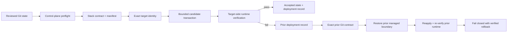

# HomeLab Ops Blueprint

**Verified Convergence for small Docker Compose environments — bounded changes, runtime evidence, and exact-contract rollback.**

[](https://github.com/d-prost/homelab-ops-blueprint/actions/workflows/validate.yml)
[](https://securityscorecards.dev/viewer/?uri=github.com/d-prost/homelab-ops-blueprint)
[](LICENSE)

[Architecture](docs/ARCHITECTURE.md) · [Adoption](docs/ADOPTION.md) · [Roadmap](ROADMAP.md) · [Security](SECURITY.md) · [Contributing](CONTRIBUTING.md)

HomeLab Ops Blueprint is a public-safe reference project for operating small Docker Compose environments with Git and Ansible without turning them into a full orchestration platform.

The project treats deployment as an **acceptance transaction**, not as a blind synchronization step. A candidate configuration becomes the accepted state only after authorization, target-identity checks, contract-bounded mutation, immutable-image validation, target-side functional verification, and acceptance recording. If the candidate fails, automatic rollback is allowed only when the exact previously accepted Git contract and its complete managed-file boundary can be restored and verified again.

This project calls that operating model **Verified Convergence**.

> **Terminology:** “proof” and “verified” in this repository mean deterministic, machine-checkable operational evidence produced by validation and runtime checks. They do not imply formal verification or cryptographic proof.

## Why this exists

Small self-hosted environments often sit in an awkward middle ground: `docker compose up` is easy, but safe changes, reproducible rollback, target selection, and recovery discipline are not. At the same time, Kubernetes and always-on GitOps controllers can be disproportionate for a small environment.

HomeLab Ops Blueprint focuses on that middle ground:

- Git remains the reviewed desired-state source;
- Production convergence is deliberate rather than automatic;
- the current control plane remains authoritative even when deploying an older release payload;
- every managed mutation is constrained by an explicit stack contract and manifest;
- images are pinned by digest;
- success is decided by runtime behavior, not by container creation alone;
- accepted state is recorded only after verification succeeds;
- rollback is re-verified against the exact prior contract;
- real topology, credentials, PKI details, backup evidence, and recovery material stay outside the public repository.

## Verified Convergence properties

The current design is organized around seven properties.

| Property | Current enforcement |
|---|---|
| **Authorized desired state** | Production preflight requires a clean `main` and exact equality with `origin/main`; deployments carry an explicit Git release commit. |
| **Exact target identity** | Inventory declares the expected hostname and the target must match it exactly before deployment proceeds. |
| **Contract-bounded mutation** | `stack.yml` declares managed destinations and `MANIFEST.tsv` validates the exact source-to-target mapping. |
| **Immutable runtime inputs** | Every managed container image must use an `@sha256:` digest. |
| **Functional runtime proof** | Expected Compose services and declared functional checks run on the target; `container=running` is not sufficient. |
| **Recorded acceptance evidence** | A compact deployment record is written only after functional verification succeeds. |
| **Verified rollback** | The role loads the exact prior contract from Git history, restores only the prior managed boundary, reapplies it, and runs the prior functional checks again. |

The architectural details and trust boundaries are documented in [`docs/ARCHITECTURE.md`](docs/ARCHITECTURE.md).

## Convergence lifecycle



A successful deployment therefore answers more than “did Compose start?” It establishes which Git state authorized the change, which target accepted it, what files were allowed to change, which immutable images were used, and whether the resulting service behavior matched the declared contract.

## Operational invariants

Several design choices are intentionally strict:

- **Current safety logic always wins.** Historical releases may supply a selected stack payload, but they never replace the current inventory, preflight, Ansible role, or verifier.
- **The target does not need a Git checkout.** Compose rendering stays on the control plane; the contract and verifier are transferred to the target for runtime checks.
- **Automatic rollback requires evidence.** If the complete prior managed-file set or exact prior contract is unavailable, the role refuses to claim a verified automatic rollback path.
- **Rollback is configuration-scoped.** Databases, media, indexes, uploads, named volumes, application-generated state, and secrets are outside the transactional configuration boundary.
- **The public repository stays public-safe.** Real Production inventory, credentials, private PKI, backup receipts, and recovery material remain private.

## A stack is a deployment contract

A stack is more than a Compose file. The reference stack contains four coordinated artifacts:

```text
stacks/dozzle/
├── compose.yaml      # runtime model; images are digest-pinned
├── defaults.env      # public-safe non-secret defaults
├── stack.yml         # target, managed files, expected services, functional checks
└── MANIFEST.tsv      # exact source-to-target file mapping
```

`stack.yml` defines what the deployment is permitted to manage. `MANIFEST.tsv` provides an independently validated mapping from repository sources to target destinations. The deployment role stages only that declared payload and refuses unsafe or incomplete contracts before accepting the candidate.

See [`stacks/dozzle/`](stacks/dozzle/) for the public stateless reference implementation.

## Current maturity

The repository currently implements and tests the single-host, stateless Verified Convergence path, including disposable rollback proof in GitHub Actions.

Remote-target execution is implemented without target-side repository checkouts, but the project still requires a bounded real remote deployment before claiming that property is proven end to end. Rich machine-readable receipts, stateful readiness gates, multi-host convergence, and independent evidence verification are roadmap work, not current guarantees.

See [`ROADMAP.md`](ROADMAP.md) for explicit exit criteria for each phase.

## Quick start

### Requirements

- Linux
- Git
- Docker Engine with Compose v2
- Ansible Core
- Python 3 and PyYAML

For the full maintainer validation suite, also install ShellCheck, yamllint, and Gitleaks.

### 1. Validate the repository

```bash
make validate
```

### 2. Create a private Production inventory

```bash
cp ansible/inventory/production/hosts.example.yml \
   ansible/inventory/production/hosts.yml
```

Edit the ignored `hosts.yml` and replace every `CHANGE_ME` value. Do not commit the real Production inventory.

### 3. Preview the example stack

```bash
bash scripts/deploy-stack.sh dozzle --check
```

### 4. Converge explicitly

```bash
bash scripts/deploy-stack.sh dozzle
```

Production guards intentionally require a clean, synchronized `main`. Do not weaken those guards for experimentation; use the disposable Lab proof instead.

### 5. Tag a verified operational release

```bash
bash scripts/tag-release.sh
```

To redeploy an earlier verified operational release:

```bash
bash scripts/rollback-stack.sh dozzle release-YYYYMMDD-HHMMSSZ
```

## Validation and CI

Local entry points:

```bash
make validate     # repository, contracts, syntax, tests, safety checks
make lab-proof    # disposable deployment + injected failure + verified rollback
make ci           # strict validation, including Gitleaks when installed by CI
```

GitHub Actions currently runs two independent validation classes:

1. **Static validation** — Bash/Python/YAML validation, stack-contract tests, Ansible syntax checks, public-safety checks, and complete-history secret scanning.
2. **Disposable rollback proof** — a real Dozzle deployment on a disposable runner, intentional failure injection, automatic configuration rollback, SHA-256 comparison, and functional HTTP verification after restoration.

A separate OpenSSF Scorecard workflow evaluates repository security practices, and Dependabot tracks pinned GitHub Actions dependencies.

## Stateful services and recovery

Verified Convergence currently protects **declared configuration state**. It does not make application data transactional.

A stateful service is not considered safely adoptable merely because its Compose deployment can roll back. Its data boundary, secrets, exports, backups, isolated restore procedure, and functional restore checks must be defined separately.

Use [`recovery/STATEFUL_ADOPTION_CHECKLIST.md`](recovery/STATEFUL_ADOPTION_CHECKLIST.md) before treating a stateful stack as Production-adoptable, and [`recovery/RESTORE_DRILL_TEMPLATE.md`](recovery/RESTORE_DRILL_TEMPLATE.md) to document restore evidence.

## Public/private boundary

The public blueprint deliberately excludes identifying or sensitive operational state. Keep the following outside this repository or in a separate private operations repository:

- real Production hostnames, IP addresses, DNS zones, and VPN details;
- passwords, API tokens, private keys, recovery codes, and secret `.env` files;
- backup credentials, Snapshot IDs, Run IDs, and real restore evidence;
- firewall exports, incident logs, private audit evidence, and PKI internals;
- break-glass procedures and private recovery material.

The validation suite enforces this boundary in addition to Gitleaks. See [`docs/PUBLIC_PRIVATE_BOUNDARY.md`](docs/PUBLIC_PRIVATE_BOUNDARY.md).

## Scope and non-goals

HomeLab Ops Blueprint is intentionally narrow. It is a deployment-safety reference, not a general HomeLab platform.

| In scope | Intentionally outside the core project |
|---|---|
| Contract-driven Docker Compose convergence | General cluster orchestration |
| Explicit Production change control | Automatic Production deployment from public CI |
| Exact target-identity guards | Kubernetes as a requirement |
| Immutable image enforcement | FluxCD or ArgoCD as a required control plane |
| Functional target-side verification | Always-on reconciliation merely to claim GitOps |
| Configuration rollback with prior-contract re-verification | Database or application-data rollback |
| Public-safe reusable automation | Production secrets, topology, PKI, and backup evidence |
| Focused reference stacks | A large catalogue of self-hosted applications |

New dependencies and abstractions should strengthen a Verified Convergence property that cannot be kept simpler otherwise.

## Repository layout

| Path | Purpose |
|---|---|
| `.github/` | CI, OpenSSF Scorecard, Dependabot, issue and PR templates |
| `ansible/` | guarded convergence logic, roles, playbooks, and example inventories |
| `stacks/` | public-safe stack contracts and payloads |
| `scripts/` | deployment, rollback, validation, verification, and safety tooling |
| `tests/` | contract, integrity, operational, and disposable rollback proofs |
| `recovery/` | stateful-adoption and restore-drill templates |
| `docs/` | architecture, adoption, release, publishing, and maintainer documentation |

## Documentation

- [`docs/ARCHITECTURE.md`](docs/ARCHITECTURE.md) — Verified Convergence properties, trust boundaries, lifecycle, and design constraints.
- [`docs/ADOPTION.md`](docs/ADOPTION.md) — how to adapt the blueprint without weakening its safety model.
- [`ROADMAP.md`](ROADMAP.md) — proof-driven development phases and explicit non-goals.
- [`PROJECT_MANIFEST.md`](PROJECT_MANIFEST.md) — implemented capabilities and validation expectations.
- [`CONTRIBUTING.md`](CONTRIBUTING.md) — contribution requirements and review policy.
- [`docs/RELEASES.md`](docs/RELEASES.md) — project releases versus operational deployment tags.

## Contributing

Contributions are welcome when they make authorization, target selection, mutation boundaries, runtime verification, acceptance evidence, rollback verification, recovery readiness, or portability stronger and clearer.

Run `make validate` before opening a pull request. Changes that affect deployment or rollback behavior should also pass `make lab-proof` on a clean Linux host.

See [`CONTRIBUTING.md`](CONTRIBUTING.md) and [`GOVERNANCE.md`](GOVERNANCE.md).

## Security

Do not publish vulnerabilities together with private infrastructure details. Follow [`SECURITY.md`](SECURITY.md) for reporting guidance.

## Releases

Public project releases use Semantic Versioning. Operational deployment tags created by `scripts/tag-release.sh` are separate from project version tags. See [`docs/RELEASES.md`](docs/RELEASES.md).

## License

MIT. See [`LICENSE`](LICENSE).
