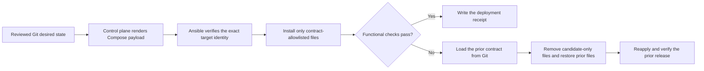

# HomeLab Ops Blueprint

[](https://github.com/d-prost/homelab-ops-blueprint/actions/workflows/validate.yml)
[](https://securityscorecards.dev/viewer/?uri=github.com/d-prost/homelab-ops-blueprint)
[](LICENSE)

A public-safe reference project for operating small Docker Compose environments with Git, Ansible, immutable image references, remote-target verification, functional checks, and transactional configuration rollback.

The project is intentionally environment-neutral. It is designed to be reusable without publishing real hostnames, IP addresses, credentials, backup metadata, private PKI details, or Production evidence.

## Why this exists

Small self-hosted environments often have enough operational complexity to need disciplined change control, but not enough scale to justify a full orchestration platform. This project focuses on that middle ground:

- reviewed Git as the desired-state source;
- deliberate, manual Production deployment;
- exact host-identity guards;
- a control plane that can deploy to targets without repository checkouts;
- immutable container images;
- allowlist-only configuration changes;
- machine-checkable source-to-target manifests;
- functional health verification instead of trusting `container=running`;
- automatic rollback of previously managed configuration;
- disposable rollback proof in CI;
- explicit separation between public automation and private environment data.

## How it works



The control plane owns rendering and orchestration; the remote target only needs Docker, Compose, and Python. A successful functional check commits the deployment state. A failed check follows the recorded prior contract and restores only files that the project previously managed.

## Safety properties

A Production deployment is refused unless the repository is clean, the current branch is `main`, local `main` exactly matches `origin/main`, a real Production inventory exists locally, and the target hostname exactly matches the inventory declaration.

Managed container images must use `@sha256:` digests. Only files declared by the stack contract and its matching `MANIFEST.tsv` may be installed. A deployment record is written only after functional checks pass.

Before replacing an already managed stack, the role reads the prior deployment receipt, loads that exact contract from Git history, and captures only its allowlisted files in a transient root-owned transaction directory. If deployment or verification fails, it removes candidate-only files, restores the prior files, reapplies the prior Compose model, verifies it with the prior contract, and removes the transaction directory.

Compose rendering stays on the control plane. Runtime checks and functional verification run on the target, with the verifier and contract transferred by Ansible. A remote target therefore needs Docker and Python, not a repository checkout.

This protects configuration changes. It is not a substitute for application-data backups or restore testing.

## Public/private boundary

The repository must never contain real operational secrets or identifying infrastructure data. Keep these outside Git or in a separate private repository:

- Production hostnames, IP addresses, internal DNS zones, and VPN details;
- passwords, API tokens, private keys, recovery codes, and secret `.env` files;
- real backup receipts, Run IDs, Snapshot IDs, and restore credentials;
- firewall exports, incident logs, private audit evidence, and PKI internals;
- break-glass procedures and private recovery material.

The validation suite includes a public-safety check in addition to Gitleaks. See [`docs/PUBLIC_PRIVATE_BOUNDARY.md`](docs/PUBLIC_PRIVATE_BOUNDARY.md).

## Repository layout

```text
.github/                    CI, Scorecard, Dependabot, issue/PR templates
ansible/                    guarded deployment logic and example inventories
docs/                       architecture, adoption, release, and maintainer docs
recovery/                   restore-drill template and stateful adoption checklist
scripts/                    deployment, validation, and safety tooling
stacks/dozzle/              public stateless example stack
tests/                      integrity and disposable rollback tests
```

## Quick start

### 1. Requirements

- Linux
- Git
- Docker Engine with Compose v2
- Ansible Core
- Python 3 and PyYAML

For the full maintainer validation suite, also install ShellCheck, yamllint, and Gitleaks.

### 2. Validate the repository

The commands deliberately use `bash` and `python3` explicitly, so CI does not depend on executable bits surviving ZIP extraction, browser uploads, or cross-platform Git clients.

```bash
make validate
```

### 3. Create a private Production inventory

```bash
cp ansible/inventory/production/hosts.example.yml \
   ansible/inventory/production/hosts.yml
```

Edit the ignored `hosts.yml` locally and replace every `CHANGE_ME` value.

### 4. Dry-run the example stack

```bash
bash scripts/deploy-stack.sh dozzle --check
```

### 5. Deploy explicitly

```bash
bash scripts/deploy-stack.sh dozzle
```

### 6. Tag a verified operational release

```bash
bash scripts/tag-release.sh
```

To redeploy an earlier verified operational release:

```bash
bash scripts/rollback-stack.sh dozzle release-YYYYMMDD-HHMMSSZ
```

## CI and supply-chain checks

The validation workflow runs two independent jobs:

- **Static validation**: Bash/Python/YAML checks, stack-contract validation, Ansible syntax checks, public-safety validation, and Gitleaks;
- **Disposable rollback proof**: real Dozzle deployment on a disposable runner, intentional failure injection, automatic configuration rollback, SHA-256 comparison, and functional HTTP verification after rollback.

A separate OpenSSF Scorecard workflow evaluates repository security practices with narrowly scoped permissions. Dependabot watches pinned GitHub Actions for updates.

## Project scope

This project is a deployment-safety blueprint, not a complete HomeLab platform. It deliberately does not provide automatic public-CI Production deployment, secret storage, firewall management, database rollback, or backup orchestration. Stateful services can be adopted only after their external data, secret, export, backup, and functional restore boundaries are documented and proven.

See [`ROADMAP.md`](ROADMAP.md) for planned work and explicit non-goals.

## Contributing

Contributions are welcome when they improve safety, portability, testing, documentation, or reusable stack contracts without weakening the public/private boundary.

Start with [`CONTRIBUTING.md`](CONTRIBUTING.md), [`GOVERNANCE.md`](GOVERNANCE.md), and [`ROADMAP.md`](ROADMAP.md).

## Security

Do not report vulnerabilities containing sensitive infrastructure details in a public issue. Follow [`SECURITY.md`](SECURITY.md).

## Releases

Public project releases use Semantic Versioning. Operational deployment tags created by `scripts/tag-release.sh` are separate from project version tags. See [`docs/RELEASES.md`](docs/RELEASES.md).

## License

MIT. See [`LICENSE`](LICENSE).
